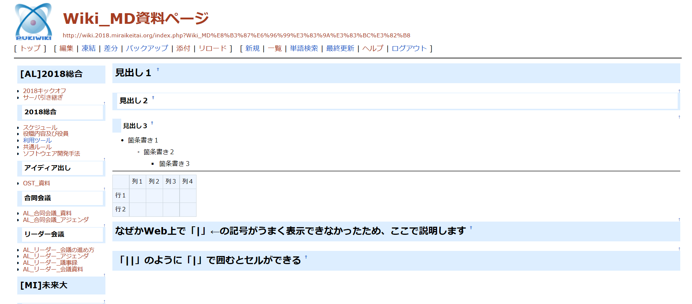
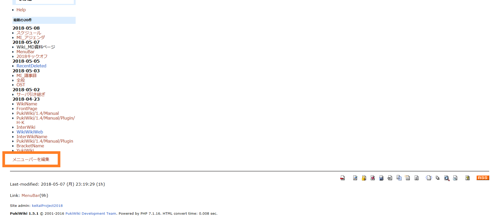

# 2018年度PukiWikiチュートリアル

## 1.ページの編集
* ページの編集をするときは、編集したいページの左上の「編集」をクリックする

  
#### 1-1.見出しの書き方
* 「*」で青い帯（見出し１）ができる  
* 「**」で白い帯（見出し２）ができる
* 「***」で白い見出し（見出し３）ができる

  
#### 1-2.箇条書き+α
* 「-」で箇条書き１ができる
* 「--」で箇条書き２ができる
* 「---」で箇条書き３ができる
* 「----」で線が引ける

  

#### 1-3.表の作り方
* 「 || 」でセルができる

  
#### 1-4.ファイルのアップロード
* ファイルをアップロードするときは、まず「添付」をクリックする

  
* アップロードしたいファイルを選択し、「アップロード」をクリックする
  * アップロードできるファイルは5120KBまでなので、それを超えるファイルはアップロードできないので注意すること

  
* アップロード後

  

## 2.メニューバーの編集
* メニューバーを編集するときは、ページを下にスクロールして、「メニューバーを編集」をクリックする
  * メニューバーの編集はページの編集と同じ記述方法で編集できる

  
#### 2-1.新規ページの作り方
* 「[[]]」で」新規ページ（仮）ができる
  * 「[[]]」でも新規ページ（仮）は作成できるが、「[[]]」だけだとそれの上のページの右側に作成されるため、「-[[]]」で作成する方が好ましい
* 作成した新規ページ（仮）の横に?マークがつくので、そこをクリックすると新規ページの編集画面に移動し、新規ページが見れるようになる

  
* ?マークが消えて、新規ページが作成された

  
#### 2-2.ページの削除
* ページを削除したいときは、「編集」をクリックし、編集画面に書かれている文字を全部消す
* その後、「メニューバーを編集」をクリックし、削除したページの部分を消す
  * 上の手順は逆でもできます

## これで最低限の使い方は説明しました。あとは自分で使って覚えましょう！！
  
## お疲れ様です。